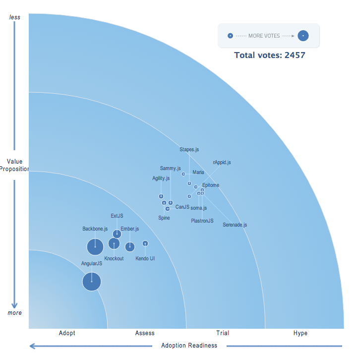

# JavaScript MVC Frameworks

## 후보
* Backbone.js
* AngularJS
* Ember.js
* Knockout
* Agility.js
* CanJS
* Spine
* Maria
* ExtJS
* Sammy.js
* Stapes.js
* Epitome
* PlastronJS
* rAppid.js
* Serenade.js
* Kendo UI

### 비교표
http://codebrief.com/2012/01/the-top-10-javascript-mvc-frameworks-reviewed/

|Framework	|UI Bindings|Composed Views	|Web Presentation Layer	|Plays Nicely With Others
|-|
|Backbone.js|✗	|✗	|✓	|✓
|SproutCore 1.x	|✓	|✓	|✗	|✗
|Sammy.js	|✗	|✗	|✓	|✓
|Spine.js	|✗	|✗	|✓	|✓
|Cappuccino	|✓	|✓	|✗	|✗
|Knockout.js	|✓	|✗	|✓	|✓
|Javascript MVC	|✗	|✓	|✓	|✓
|Google Web Toolkit	|✗	|✓	|✗	|✗
|Google Closure	|✗	|✓	|✓	|✗
|Ember.js	|✓	|✓	|✓	|✓
|Angular.js	|✓	|✗	|✓	|✓
|Batman.js	|✓	|✗	|✓	|✓

http://www.infoq.com/research/top-javascript-mvc-frameworks?utm_source=infoq&utm_medium=popular_links_homepage

## Backbone.js:
* 홈페이지 http://backbonejs.org/
* 튜토리얼 http://backbonetutorials.com/
* Provides models with key-value binding and custom events, collections, and connects it all to your existing API over a RESTful JSON interface.
* Models, Collections, Views

## AngularJS
* A toolset based on extending the HTML vocabulary for your application.
* Ember.js: Provides template written in the Handlebars templating language, views, controllers, models and a router.
* Knockout: Aims to simplify JavaScript UIs by applying the Model-View-View Model (MVVM) pattern.
* Agility.js: Aims to let developers write maintainable and reusable browser code without the verbose or infrastructural overhead found in other MVC libraries.
* CanJS: Focuses on striking a balance between size, ease of use, safety, speed and flexibility.
* Spine: A lightweight framework that strives to have the most friendly documentation for any JavaScript framework available.
* Maria: Based on the original MVC flavor as it was used in Smalltalk - aka "the Gang of Four MVC".
* ExtJS: Amongst other things offers plugin-free charting, and modern UI widgets.
* Sammy.js: A small JavaScript framework developed to provide a basic structure for developing JavaScript applications.
* Stapes.js: A tiny framework that aims to be easy to fit in an existing codebase, and because of its size it's suitable for mobile development.
* Epitome: Epitome is a MVC* (MVP) framework for MooTools.
* soma.js: Tries help developers to write loosely-coupled applications to increase scalability and maintainability.
* PlastronJS: MVC framework for Closure Library and Closure Compiler.
* rAppid.js: Lets you encapsulate complexity into components which can be easy used like HTML elements in your application.
* Serenade.js: Tries to follow the ideas of classical MVC than competing frameworks.
* Kendo UI: Combines jQuery-based widgets, an MVVM framework, themes, templates, and more.
